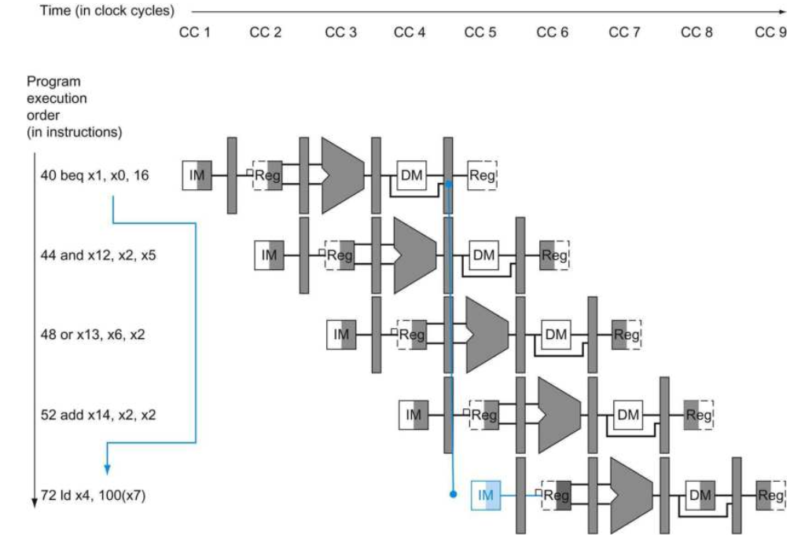

#### Pipeline CPU: Control Hazard

In the pipeline design, every clock cycle the IF will fetch an instruction from memory. However, the branch instruction cannot proceed to instruction fetch until the MEM stage, and the branch result can conflict the default instruction location. This is called **Control Hazard**

Shown above, the *beq* branch result is not computed until the MEM stage, while the IM stage will fetch the instruction by default. The branched address should be the 0x72 place, while the default updated instruction address is 0x44. This conflict lead to severe mistakes.

##### Assume No branch is taken

A common solution to this control hazard is that, assuming no branch is taken and continue the pipeline by default. When the branch is take, the instructions that are being etched and decoded must be discarded. Execution continues at the branch target. To discard instructions, this is pretty much same as Data Hazard, which is simply change **nops** to pipeline stages and replace the PC as newly branched target address. In other words, the wrong branched instructions and its corresponding data in the pipeline must be flashed out and re-take the new branched target instruction to continue the whole pipeline.

##### Dynamic Branch Prediction

Besides the above assumption solution, predicting branch target is another way. By adding more hardware and even with the help with compiler, it is possible to predict the branch behavior during the program execution. One implementation of this approach is a branch prediction buffer or branch history table. A branch prediction buffer is a small memory indexed by the lower portion of the address of the branch instruction. The memory contains a bit that says whether the branch was recently taken or not.