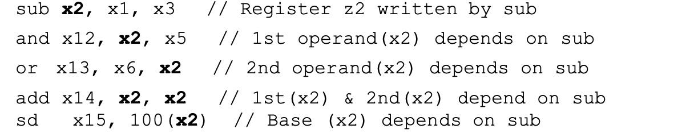
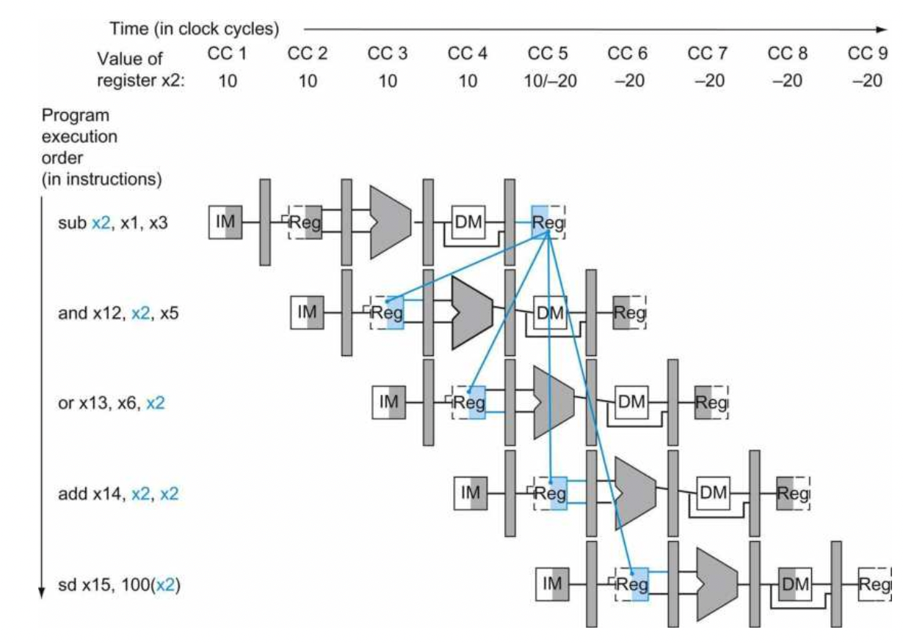
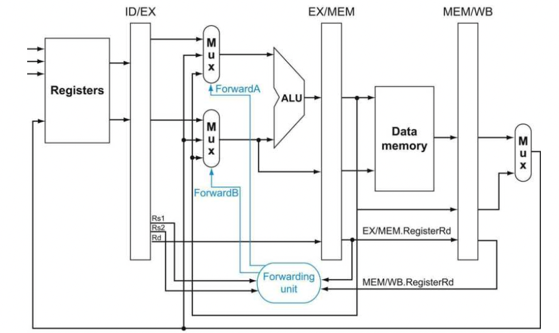
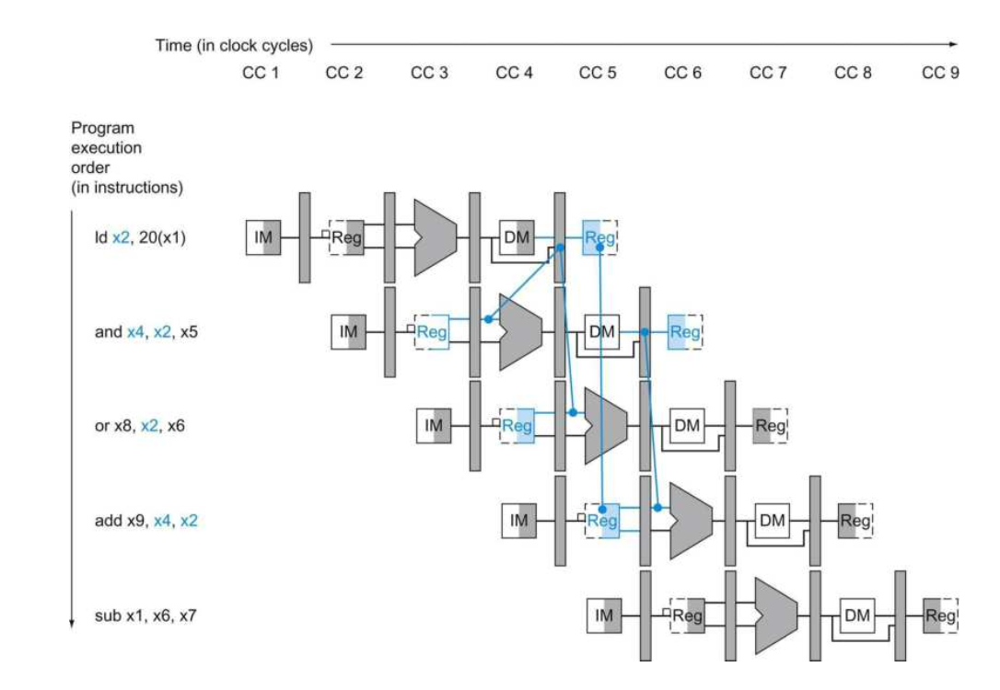

#### Data Hazards in pipeline cpu design: Forwarding vs Stalling

##### What is Data Hazard

Data Hazard happens every time when the successive instructions rely on previous register value which has not been updated yet. Following sequence shows clearly how data hazard affect the pipeline system.



It is clear that, the x2 register affects all the instructions followed by 'sub', which cause the data hazards. The data hazard shows more details and clearly in a multi-cycle data-path figure. Assume X2 initially is 10, and will be subtracted 20 in 'sub' instruction.



From the time axis, the first instruction does not write the X2 register until the 5th clock cycle, however,  'and', 'or' and 'add' instructions require the updated value before or on the 5th clock cycle at the same time. There is no way that the data can reverse back along the time axis form right to left. Now data hazard is occurred.

##### Forwarding

One simple solution to this is **forwarding**: Note that, the actual available result of the subtraction instruction is computed in the 3rd clock cycle, where it is possible to pass the computed results from ALU output directly back to the input terminal as the input of next instruction in next clock cycle. At the same time, it saves time that used to read and output the register file value. 

*When an instruction tries to use a register in its EX stage that and earlier instruction tends to write in its WB stage, this value actually needed to be forwarded as an input to the ALU.*

###### Dependency Detection

A notation as "ID/EX.rd" refers to the "rd" register value that stored in "ID/EX" pipeline register. Therefore, back to the top situation, whenever the operand register in EX stage is the same as the register of prior instruction in WB stage, there is a forwarding required. The Hazard Conditions can be noted as : 
$$
EX/MEM.rd=ID/EX.rs1\\
EX/MEM.rd = ID/EX.rs2\\
where\ rd\neq0
$$
This equation set notes that, the *rd* register in the EX/MEM pipeline register of prior instruction is the same as *rs1* or *rs2* register in ID/EX pipeline register.  For the above *sub x2, x1,x3* and *and X12, x2, x5*, the *rd* operand of *sub* instruction stored in *EX/MEM* pipeline register are exactly same as the *rs1* source register,*rs1*, of *and* instruction. So , this condition match the first equation in above equation set.

Similarly, whenever the WB operand is the same as source register, there is also a data hazard condition.
$$
MEM/WB.rd=ID/EX.rs1\\
MEM/WB.rd=ID/EX.rs2\\
where\ rd\neq 0
$$
A notable fact is that, the RISC-V ISA usually use register *X0* as zero register, which is alway set as zero when the instruction is finished. Therefore, the forwarding process cannot forward a non-zero result of *X0* , also the *X0* register is prohibited to be the write destination. So the $rd\neq0$ equation prevents forwarding the wrong value and destination to successive instructions.<br>At the same time, some instructions do not have write-back operation, which does not trigger the regWrite signal in register file. In this case, the forwarding process must not pass any information.

###### Forward the data

Dependency check solve the problem that when should I forward the data, while the data-path need a new forwarding unit to forward all wanted data to the ALU inputs.



The example control logic for forwarding unit shows below.

| Mux Contorl   | Source | Explaination                                              |
| ------------- | ------ | --------------------------------------------------------- |
| ForwardA = 00 | ID/EX  | Rs1 value comes from register file                        |
| ForwardA = 10 | EX/MEM | Rs1 value comes from prior ALU output                     |
| ForwardA = 01 | MEM/WB | RS1 value comes from data memory or earlier ALU result    |
| ForwardB = 00 | ID/EX  | RS2 value comes from the register file                    |
| ForwardB = 10 | EX/MEM | RS2 value comes from prior ALU output                     |
| ForwardB = 01 | MEM/WB | RS2 value comes from data memory or and easier ALU result |

**Control Strategy:** As discussed before, there is no data hazard in WB stage, so only EX and MEM stages require the hazard control. <br>The EX hazard control is quit straight forward that we only need to ensure the MEM.regWrite signal is triggered and EX/MEM.rd is not zero.

```verilog
if(EX/MEM.regWrite && EX/MEM.rd != 0)begin
  if( EX/MEM.rd = ID/EX.rs1)
	ForwardA = 10;
  else
    ForWardB = 10;
end
```

For MEM hazard control, a notable issue is that, when program is performing a successive series of add operations, such as 100 times sum up: *add x1, x2,x2 add x1x1,x3, add x1, x1, x4  ...*  This time, the forwarding data should come from EX/MEM stage, where the result is the newest one. Therefore, we must distinguish the EX/MEM and ID/EX stage forwarding process, just add a pre-condition before triggering the EX/MEM forwarding.

```verilog
if(EX/WB.regWrite && MEM/WB.rd !=0)begin
  if (~(EX/MEM.regWrite && EX/MEM.rd !=0))
    if(EX.MEM.rd = ID/EX.rs1)
      ForwardA = 01;
  if(EX/MEM.rd = ID/EX.rs2)
    ForwardB = 01;
end
```

##### Stalls

There is still a drawback of above mentioned forwarding method, where the pipeline must be stalled whenever an instruction tries to read a register following a load instruction that write the same register.



For the *and* instruction, there is no way to forward the loaded data in cycle 5 to past cycle 4, from right to left, reversing the time axis. Therefore, the only way to solve this data hazard is to stall the pipeline for one clock cycle, where the pipeline data path is stopped and does nothing in the free clock cycle.<br>Thus, a *hazard detection unit* or *stall unit* should be inserted into the ID stage, to stall the whole pipeline whenever the above hazard is occurred.

```verilog
if(ID/EX.memRead && (ID/EX.rd == IF/ID.rs1) || (ID/EX.rd == IF/ID.rs2))
  stall the pipeline
```

To stall a stage, other stages must also be stalled, in which, the overall effect to whole pipeline is doing nothing, which is called **nops**.