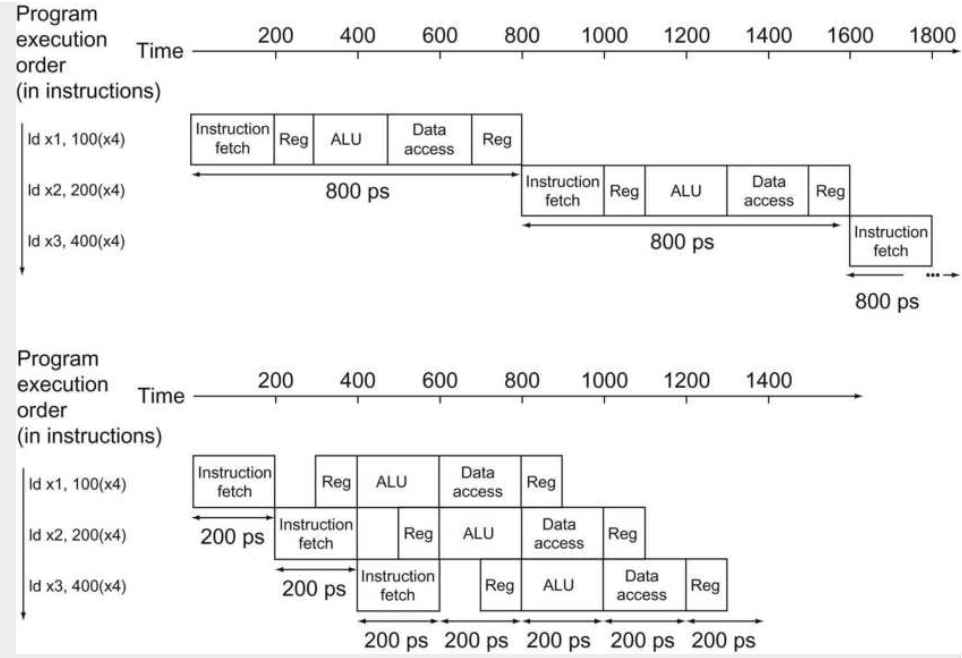
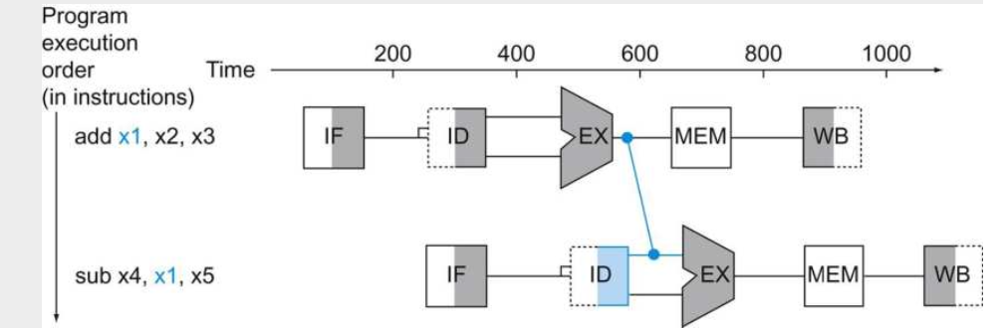

### Pipelined Multi-cycle CPU

#### Why pipelined CPU design ?

In previous 2 notes, the single cycle CPU design is discussed, and also successfully implemented RISC-V 64I instruction set. However, this kind of simple design is very slow and in a low performance in modern CPU design.  A significant drawback is that, there are lots of instructions but all modules share the same clock cycle, which is determined by the critical path. ***Critical Path**: the longest data path that instruction is applied in the whole CPU data path schemes*. In general, the load/store instruction causes the most time, since it requires most stages in the data-path: from decoder, ALU, register file, memory module even write back to register file. Therefore, the total 5 stages determine the CPU clock frequency. However, in most case, the other instructions can be down in a very limited small period.  To sum up, pipeline design is a method that improve the cpu instruction throughput by taking several instruction concurrently rather than reduce the execution latency/time of each instruction.

#### How does pipeline improve the performance/efficiency?

Classic evaluation is termed as time/program, which is the lower the faster a cpu is. This term can be rewritten as below
$$
time/program = \frac{time}{cycle}*\frac{cycle}{instruction}*\frac{instruction}{program}
$$
*time/cyc* term is related to the detailed architecture and hardware implementation .*cyc/inst* is related to detailed architecture, hardware implementation and the instruction mixture. *inst/prog* is mainly caused by the quality of program and the architecture details.

Furthermore, considering 3 instructions as an example, in which compare the pipelined and single-cycled design performance.

In the above figure, the upper part shows that,  non-pipeline design process each instruction sequentially. In contrast, the pipelined version processes the instructions concurrently in each stage. The overall effect of  pipeline is improving the factor *inst/cycle* and decrease the impact of critical path so that the clock frequency is significantly improved. Ideally, when the amount of instructions are large enough the improved time duration is calculated by
$$
TimeDuration_{pipelined} = \frac{TimeDuration_{non-pipelined}}{Num\ Of\ pipestatges}
$$

#### Hazards for Pipeline

Improved pipeline processor has better performance but also more complex design that can deal with several data path hazards in processor.

##### Structural Hazard

This kind of hazard happens when a planned instruction cannot execute in the proper clock cycle because the hardware does not support the combination of instructions that are set to execute. However, RISC-V instruction set was designed to be pipelined, and made easier for module designs, there are limited chances structural hazard will occur is we follow the design convention. However, suppose we have only one memory block, where instruction fetch and data accessing happens at the same time, there is no way for single module to output/read two separate different datas at the same time, therefore, the structural hazar now is happened.

##### Data Hazard

This kind of hazard happens when a planned instruction cannot execute in the proper clock cycle because data that are needed to execute the instructional not yet available. Considering two sequential following instructions `add x19, x0,x1.  sub x2, x19, x3`. In this instruction block, the *sub* instruction cannot get the added until the ALU result has been written into register x19. Primary solution for this kind of hazard is based on the observation that don't need to wait for the instruction complete before trying to resolve the data hazard. We can add extra hardware to retrieve the missing item early from the internal sources, which is called **forwarding/bypassing**.

In the above example figure, the EX ALU output can be fed directly into the input portal as the input of next instruction stage, this process can solve the data hazard and save the instruction processing time. **However, forwarding cannot solve all the data hazards.** Suppose the first instruction is a Load of X1 rather than add. The X1 data will be available only when the fourth stage memory module is operated, which is too late even forward the output of fourth stage into the third stage of next instruction. Therefore, there must be a stall stage for such as **load-use data hazard**. The ***pipeline stall*** is also called ***bubble***.

###### Load-use data hazard

This is a specific form of data hazard, in which data being loaded in load instruction have not yet ready for another instruction to be used. To avoid this hazard, a **pipeline stall/bubble** is instantiated, at the same time, the compiler will try to optimize the code to avoid this kind of problem from software prospective.

##### Control/Branch Hazard

This kind of hazard happens when the proper instruction cannot execute in the proper pipeline clock cycle because the instruction that was fetched is not the one that is needed; that is, the flow of instruction addresses is not what the pipeline expected. There are two primary ways to solve this problem. **Stall:** Immediately stall after when a branch is fetched, waiting until the pipeline determines the outcome of the branch and knows what instruction address to fetch from.  However, even stall can delay the later instruction starts, there is no way, in most cases, to solve the branch in the initial 2 stages, therefore, the cost is too high forcing to an other solution: **Predict**.  Branch prediction is a method of resolving a branch hazard by assuming a given outcome for the conditional brach and proceeds from that assumption rather than waiting to ascertain the actual outcome.

