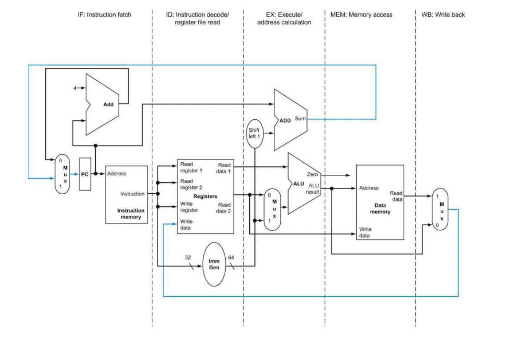
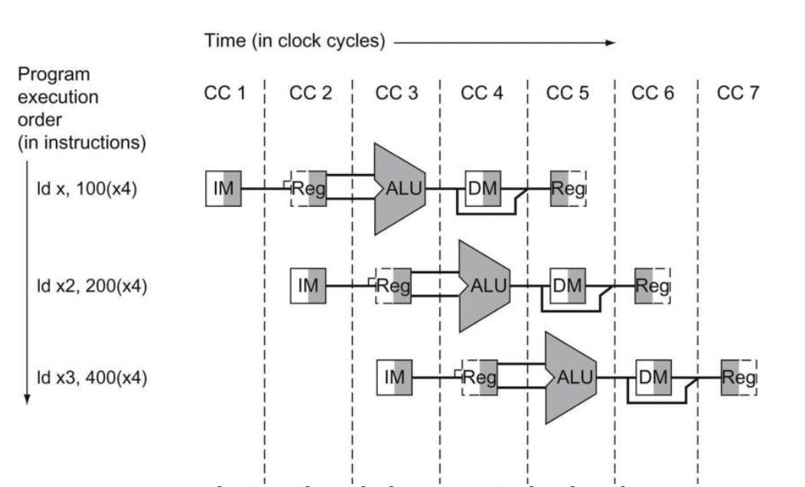
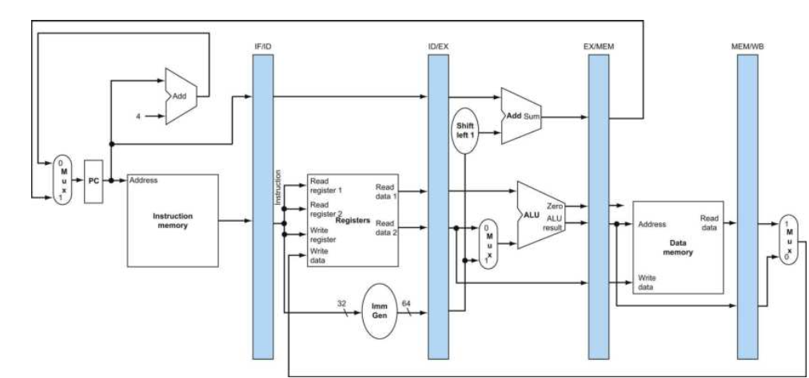
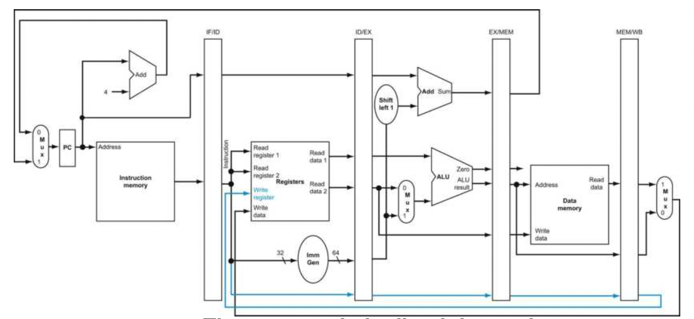
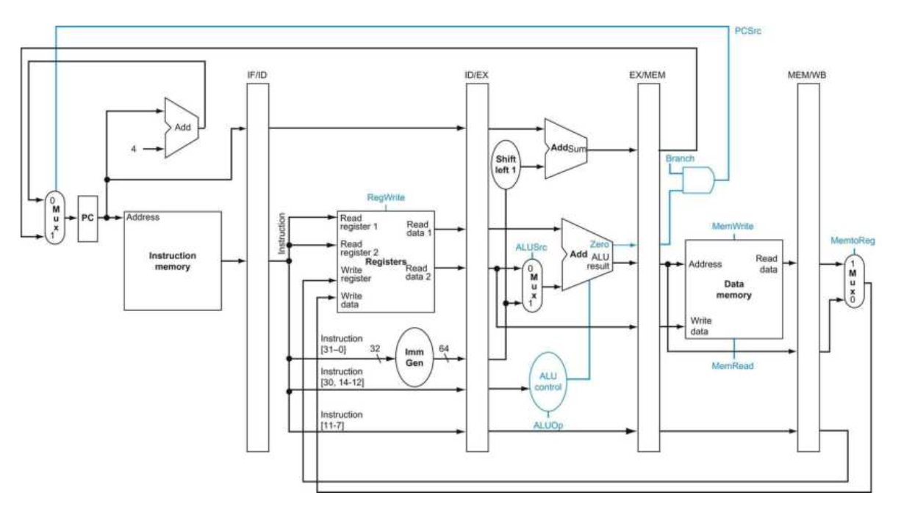
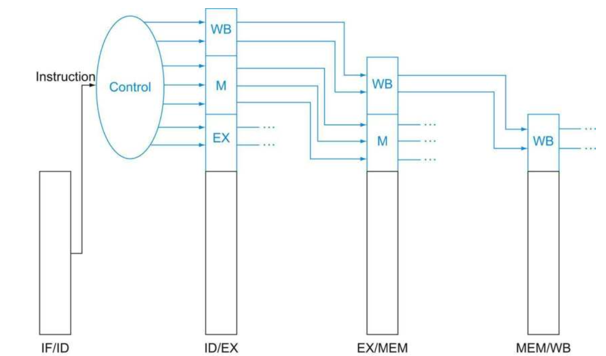
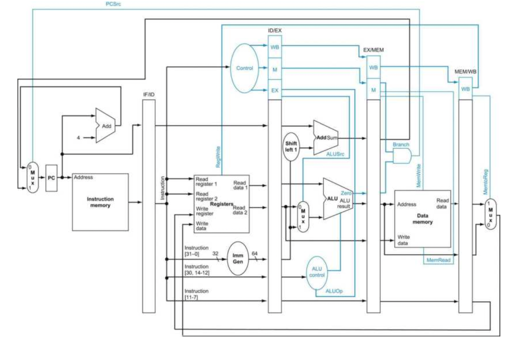

### Pipelined CPU: DataPath & Control

#### Overall datapath in 5 stages

In the above figure, the 5 stages from left to right, demonstrates how the data is flowing in and interacts in the CPU modules. Instructions and data move generally from left to right through the five stages as they complete execution. However, there are two exceptions that data/instructions flow left-to-right. 

- Write Back stage: places the result back into the register file in the middle of data path.
- PC value selection: the PC value is chosen between the default PC+4 and branch address from the EX stage to IF stage.

The right-to-left flow does not affect current instruction execution, these reverse data movements, however, will affect the later instructions so the data hazard may occur.

#### Flow Chart: Analyzing pipeline data/instruction flow

A good way to analyze the pipeline data path is put each instruction with its own data path  into a same time axis, just shown below.

The left shaded stands for write in operation, and right shaded is for read and output operation. A notable truth is that, the flow chart implies that, there are ideally 5 parallel data path at the same time, however, there is only one share data path. ***To retain the valid data of each instruction for the other 4 stages, there must be a register between each stage to store the data between previous and current data state.***

#### Pipelined DataPath with Registers

These colored panels represent the registers that separate each pipeline stage. The pipelined registers must be wide enough to hold all the data. For example, the register IF/ID, separating *Instruction Fetch* and *Instruction Decode* stages, must be 96 bit wide, to hold both 32-bit instruction and 64-bit PC address.

##### Trick and Correction for Load Instruction

In the load instruction, the final stage MEM/WB requires a write-in register index to write the extracted data into register file. However, in the pipelined data path, the previous stored numbers in IF/ID register has been overwritten by the next following instruction at the same time when current load instruction is proceeded to the ID/EX state. Therefore, we need an extra register to store the write-back register number. A corrected data-path version is shown below.

In this figure, there is an extra input port of register file, which are designed specifically to be fed by the write-back register number. The write-back register number is decoded and transferred into each stage registers to preserve the valid number. Therefore, the write-back process can make a correct write-in operation.

#### Graphically Representing Pipelines

There are two basic styles of pipeline figures: *Multiple-clock-cycle pipeline diagrams*, same as the second chart above, and *single-clock-cycle pipeline diagrams*, same as the  third chart above. Multiple-clock-cycle pipeline diagram shows overall general information in different clock cycle, however, does not give detailed combined information about the pipeline in each stage. On the other hand, the single-clock-cycle pipeline diagram demonstrates more information about the detailed information on each stage.

#### Pipeline Control

The pipeline control is just the same as the single-cycle implementation, besides that  we need to trigger and determine the signals on each clock cycle.  However, there is no need to specify the control signal for stage registers since the registers are always writing and being written every time. To specify control for the pipeline, we need only set the control values during each pipeline stage. Because each control line is associated with a component active in only a single pipeline stage, and the control lines can be divided into five groups according tot he pipeline stage. 

| Stage                                 | Description                                                  |
| ------------------------------------- | ------------------------------------------------------------ |
| Instruction Fetch                     | instruction fetch, PC write are always asserted, so there is no special to control in this pipeline. |
| Instruction decode/register file read | The rs1 rs2 are always the same location in the risc-v instruction bits, so there is nothing special to control in this pipeline stage. |
| Execution/address calculation         | ALUop and ImmediateSrc, selecting the ALU operation and wether it is a sign-extended immediate as inputs to ALU. |
| Memory Access                         | Branch signal tells wether the PC need to branch, MemWrite and MemRead set the memory module operation. |
| Write-back                            | MemtoReg decides whether the ALU result or MemoryData is write back to register file. And the RegWrite trigger the regfile to accept the input. |

*Implementing control logic means setting the seven control lines to these values in each stage for each instruction.*

Since the control signals stars with the Execution/Address calculation stage, we can simply create the control information during instruction decode for the later stages. The simplest way to pass these control signals is to extend the pipeline registers to include control information.

The decoded control signals are transferred to later stage registers allowing the control signal passing along with the data path in each clock cycle.

