### Single Cycle CPU 1

####  DataPath Modules

##### Instruction Fetching &  Decoding

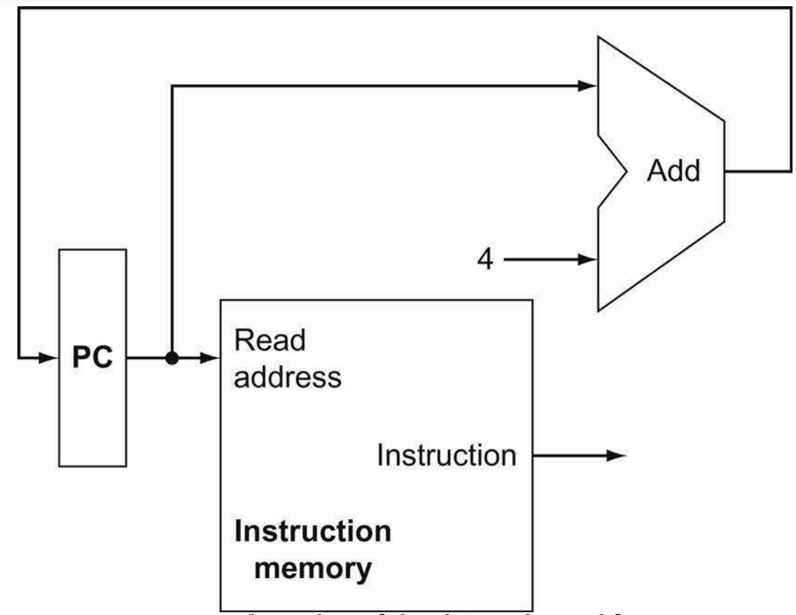

**PC** <>This module consists of Program Counter(PC), adder and Instruction memory. **Program counter** is a register that output the instruction machine code into the **Instruction Memory unit**. At the same time, by default, the PC will be updated/ incremented by 4 bytes to point to next instruction memory location. 

**Instruction Memory**  Instruction Memory is a register file (RF), that contains the complete binary machine coded assembly language instructions. At the same time, this unit will decode the input read instruction from PC and output corresponding signals to next logic units. **Note:** there are many types of instruction in RISC-V including, R-type, I-type, U-type, L-type, etc. Different type of instructions has different coding format, but the least significant 7-bit of each code tells the instruction type.  The decoding idea is that, *read the 0-6 bit first and then based on the instruction type we can apply different code reading formats.*

##### Register Operand & Arithmetic Unit

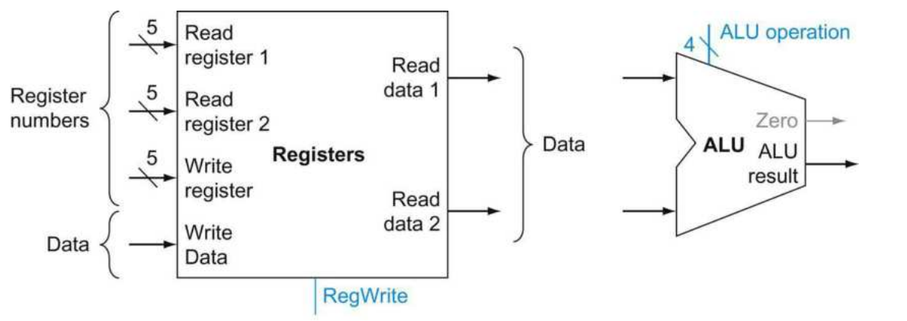

**Register Unit** There are 32 registers inside the CPU architecture, the **Register Unit** is the unit that accept the input instruction code from **Instruction Memory Unit** , then drive the specified register operands and produce related output data to ALU unit.  Recall that, RISC-V assembly language has R-type, I-type, U-type, L-type modes instructions.  1. All the instructions has maximum 2 register operands and 1 immediate number, so that the input register numbers only accept 2 5-bit input that specifies the register address. Same apply for the 2 read data output ports, only 2 register/memory location maximum are allowed, so only 2 numbers feed to ALU unit. 2. For the load/store instructions, the instructions only allow write data to single register/location each time, so that there is only one port that accept the input data. 3. Although the input register requires only 5bit (2^5 = 32) width, the input data wire and output data wire are all 64-bit width.

**ALU Unit** The ALU unit performs all the arithmetic operation. The 4-bit input port selects the operand that applied to the two input numbers. 1. This unit not only used for simple mathematic operation, it also involved in conditional jump/branch command. The equality check is usually done by check wether the difference of two number is zero. The computed output will then feed into the *Data Memory Unit* in later path. 2. On the other hand, most of the time, the load/store operation specify a base register as base address and then an immediate. The immediate is a 12-bit coded number in instructions, therefore, this number will be signed extended to 64 bit before feed into the ALU (Not shown here), so does that read base address. 3. In some other cases, the modification to an address should be write back to the register files (RF) or write into the data memory, so that, the ALU unit output usually connected with some control units that check the necessity to write back or write into memory.

##### Data Memory Unit & Signed Extension shifter

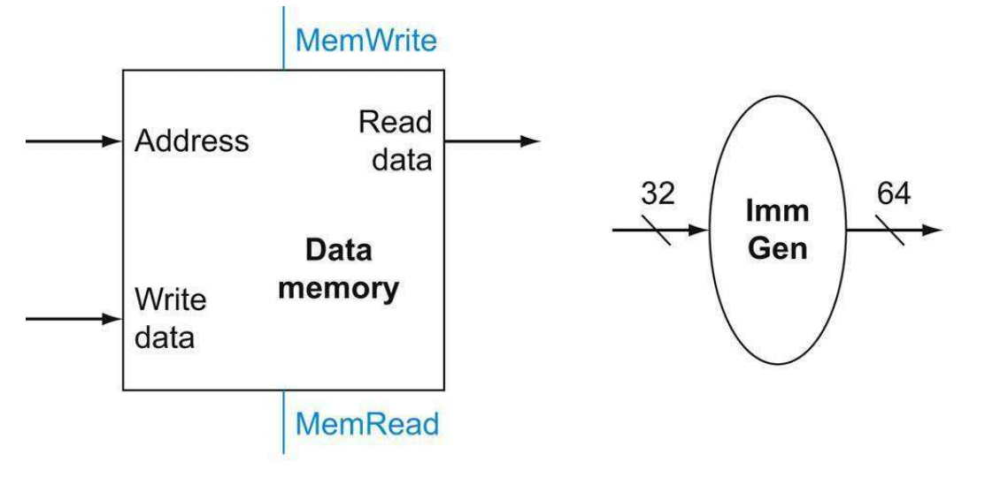

**Signed Extension Shifter** Recall that, the decoded immediate number will be signed shift to 64-bit before direct feed to t ALU unit. The shifter accepts the bits from Instruction Memory unit and shift the number signed to 64-bit then feed to ALU. It is also possible to accept input from other units that generate 32-bit output but requires 64-bit input for next stage.

**Data Memory Unit** Data memory unit store the data and accepts the input address specification from ALU unit and the write-in data from register files (RF). Therefore, *All the number input to RF are the address number rather than the real direct data number except the immediate number.* This unit demonstrates that, the CPU manipulates the data storage through *address-data* pairs. Even for the registers, the numbers stored in registers sometimes are pointers to the address who are paired and sorted in this Data Memory Unit. At the same time, this unit output will some times write back to the registers to re-load the values stored in registers or PC. Same, these kind of values requires bit-extension (unsigned) based on the instruction content.

#### Overall DataPath without Control

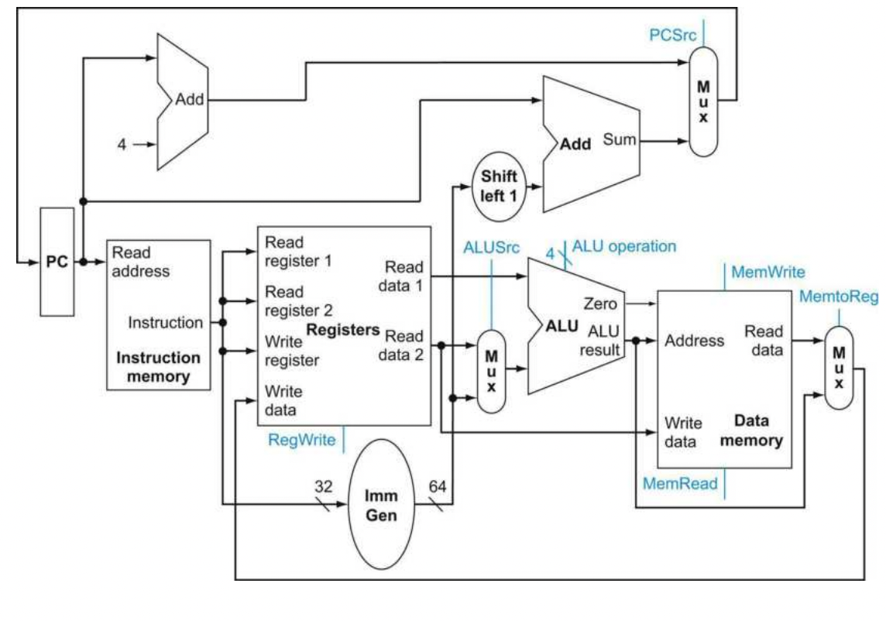

The above discussed modules implements the overall data path shown above. Overall, the **PC** will fetch the binary coded instruction from its stored memory address, and the **Instruction Memory** module will then decode the instruction, feed the specified immediate, registers into the **register file**.  For the immediate operand, this 12-bit number will be signed extended to 64-bit width. If the instruction require to compute address increment based, thus, the immediate address number will be shift left 1-bit.(*Since all the address are 4 bytes aligned, the LSB is redundant, moving 1 bit will enlarge twice the branching range.*) Then, the Adder upside will increase the instruction address of PC, thus, the next executed instruction will not be PC + 4 but PC + Imm. On the other hand, the **register file** will output the read value from corresponding register and feed the output into the ALU module. The ALU module can test the jump/branch condition or apply the instructed arithmetic operation for two inputs. Later on, the ALU computed result will feed into the **Data Memory** module as an input address. The Data Memory Module will read the data from specified address and perform several instructed operations such as write back the data into register, feed the data to next external module, etc.

#### Control Units

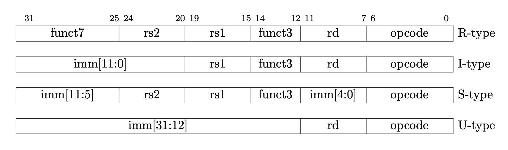

This figure demonstrates the RISC-V instruction encoding format. The first 7-bit [31-25] called *funct7* and the middle 3 bit [14-12] called *funct3*. For all the types of codes, the rs2, rs2 and rd position are fixed, leading to clear and simplified hardware decoding design. U-type is sometimes mixed with J-type, these two types are used for conditional/unconditional branching and jumping  **R-type:** Register-Register operation. 

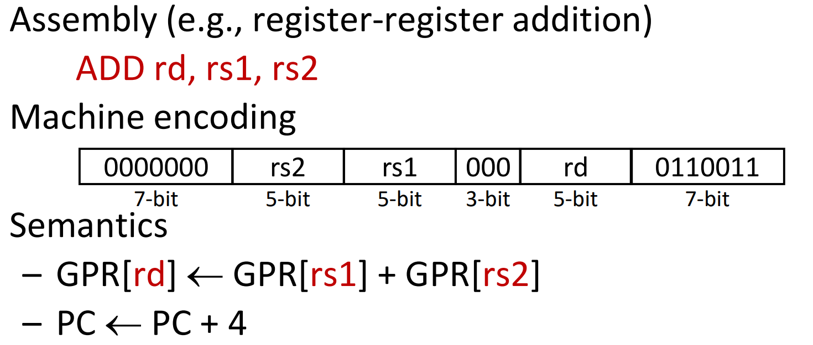

**I-type:**Register-Immediate operation, includes Load operation, 

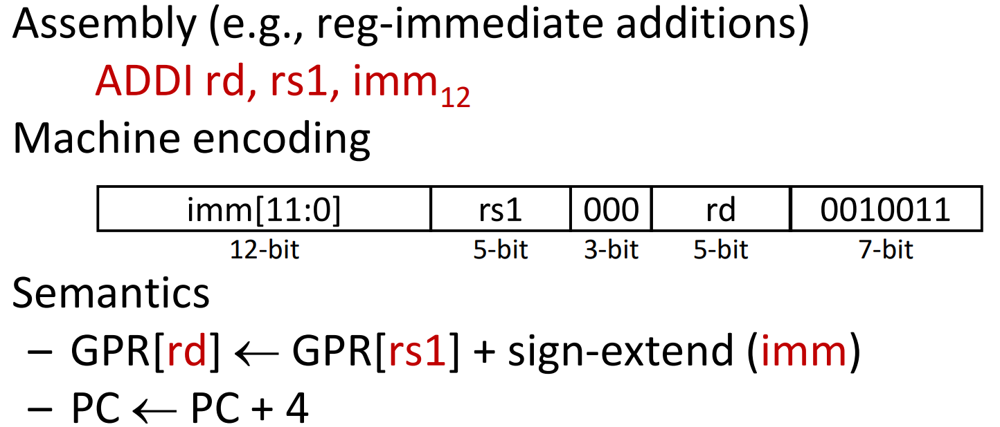

**S-type:** Register-Immediate operation, usually Store operation

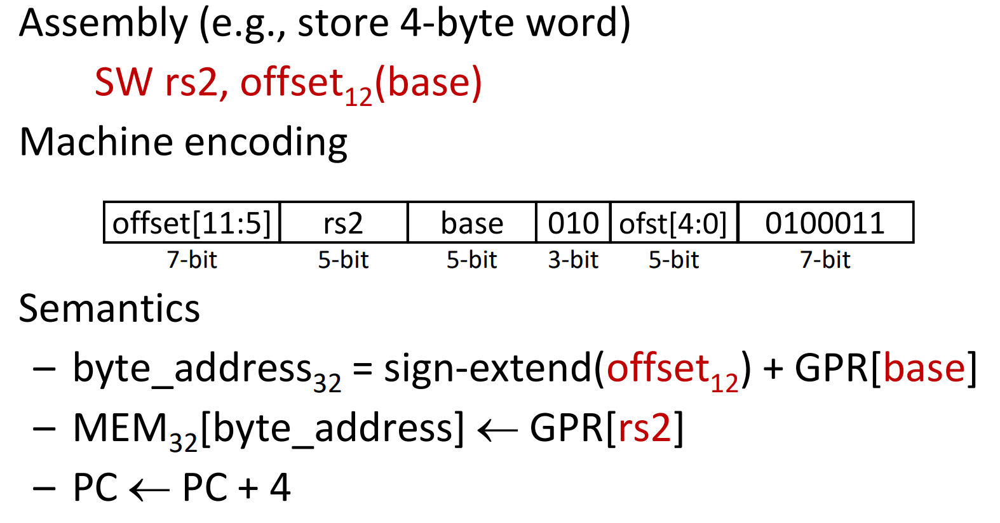

**J-U type**: Conditional/Unconditional Branching/Jumping instruction

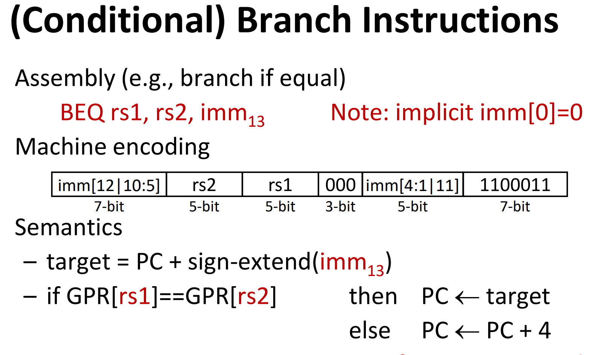

##### ALU Control Logic

**ALU Function:** For R-type, the ALU should apply *Add, Subtract, AND OR* 4 operations based on the 7-bit [31-25], the funct7 part, and 3-bit [14-12], the funct3 part in R-type machine code. For S/I type, the ALU should apply add operation to compute the offset address. For J-U type, the ALU will test the equality result by subtracting two operand and checking zero difference.  Based on the above functions described, we can summarize that, the ALU need to perform 4 functions, based on different Funct7 and Funct3 bits. Checking the opcode table, we can have the following relations between Funct7 and Funct3 bits to ALU functions

###### ALU Control logic Mapping

| Instruction Opcode | ALUOp | Operation         | Funct7  | Funct3 | ALU function | ALU control Input |
| :----------------- | ----- | ----------------- | ------- | ------ | ------------ | ----------------- |
| Ld(I-type)         | 00    | Load double word  | X       | X      | add          | 0010              |
| Sd(I-type)         | 00    | Store double word | X       | X      | add          | 0010              |
| Beq(U-J type)      | 01    | Branch if equal   | X       | X      | Subtract     | 0110              |
| R-type             | 10    | add               | 0000000 | 000    | Add          | 0010              |
| R-type             | 10    | sub               | 0100000 | 000    | subtract     | 0110              |
| R-type             | 10    | and               | 0000000 | 111    | And          | 0000              |
| R-type             | 10    | or                | 0000000 | 110    | OR           | 0001              |

* To control the other modules simultaneously, there must be a main control unit who will output different control signals based on the input instruction code. ALUOp is the output from the main control units and feed into the ALU control unit to generate the ALU control signal.
* 'X' term means don't care.
* There are 4 types of functions encoded into ALU requiring 4 codes for ALU operations, and 3 types of instruction code requiring 3 codes for ALUOp.
* We use 4 bits to encode the ALU functions, stands for at least 9 kinds of operations: add, sub, divid, multiply, AND, OR, NOR, set less-or-equal, etc.

##### Main Control Units

Back to the *DataPath Modules*, there are some control logics for *DataMemory Module, Register Module, ALU Module.*

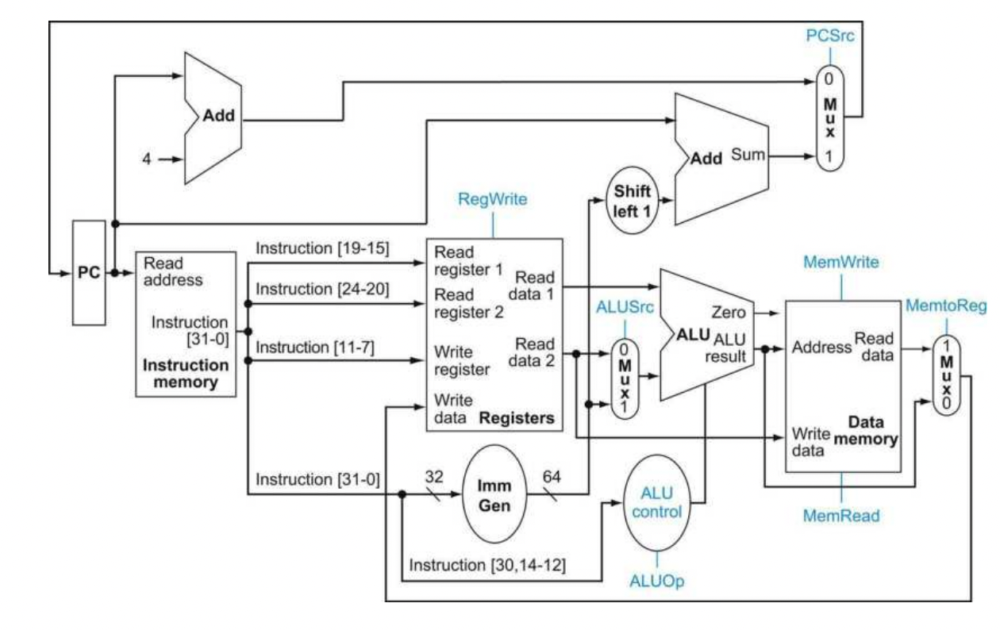

* DataMemory Module requires *MemWrite, MemRead, MemtoReg* three enable lines to indicate the read data flow path.
* Instruction Memory Module requires  a *PCSrc* signal that specify whether the next instruction address is updated by 4byte in default or newly incremented address.
* Register Files Module requires *RegWrite* signal to enable the register write operation.
* Besides the ALUOp signal, the ALU module also requires  *ALUSrc* signal specify that wether the input source is coming from register or shifted immediate number.

There are 7 signal lines  in total, including the ALUOp signal discussed above. The summary is shown below.

###### Control Logic Mapping

| Signal Name | Effect when De-asserted/False                                | Effect when Asserted/True                                    |
| ----------- | ------------------------------------------------------------ | ------------------------------------------------------------ |
| RegWrite    | None.                                                        | Write the input data from the port WriteRegister to specified register. |
| ALUSrc      | The second ALU operand comes from the second register file output | The second ALU operand is a sign-extended immediate from instruction |
| PCSrc       | The PC is incremented by 4 bytes                             | The PC is updated by the adder output that specifying the branch address. |
| MemRead     | None.                                                        | Read the data from specified address and output it           |
| MemWrite    | None.                                                        | Write the data of input write data port into specified address |
| MemtoReg    | The value fed to register write data input  comes from ALU   | The value fed to register write data input comes from the data memory |

##### Complete control datapath

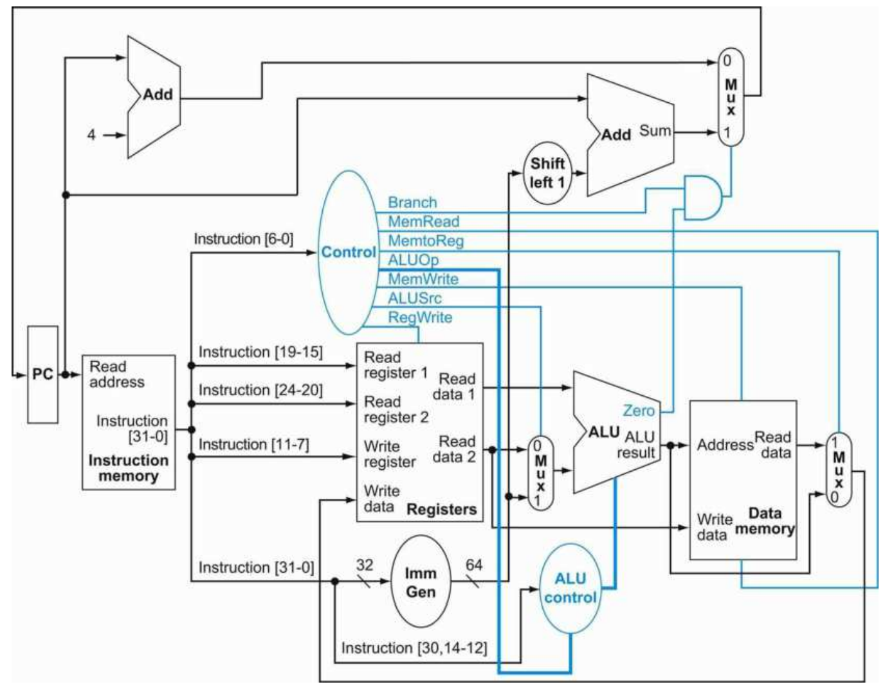

 The whole complete data-path control. Main control unit outputs 7 signals using the 7-bit opcode from instruction code, only ALUOp requires 2 bits rest of them are all 1-bit signal. Note that, the PCSrc signal is derived by the AND operation of Branch and ALU zero output signal, where the PCSrc name is dropped for simplicity.

