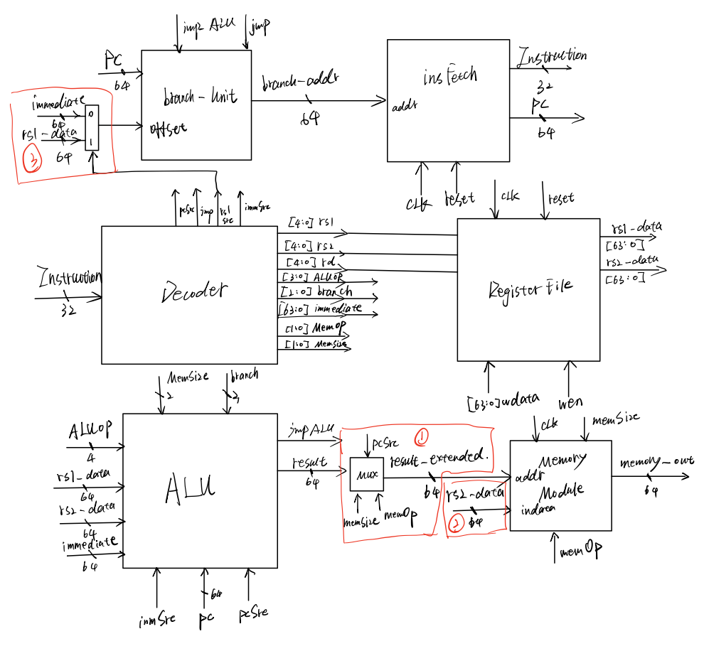

#### Single Cycle CPU2

In this Markdown File, I will note down my implementation procedure of a single cycle CPU based on RISC-V RV64 ISA. The note demonstrates how each functional module is assembled and interacted with others, and also a notable edge case when dealing with compatibility of RV64I and RV32I format commands.

##### Full Design Diagram

The above figure shows how I designed the full data-path in the first single cycle CPU. The red blocks are the essential experiences and tricks that I found out in countless suffering debug time, and all these will be discussed in the later detailed modules explanations.**The "rs1_data" in branch_unit should be "result" from ALU.**

##### Decoder Design

The decoder module performs a key function that mapping the generated control signal with all other modules, which are controlling the input/output format, arithmetic operation types, jump address and load/store memory. Based on the basic RV32-I instruction, and the four types of RISC-V instructions (I-type, R-type, J-type, B-type), the output controlled signal are defined as 5-bit width register name/address signal, 3-bit branch type signal, 64-bit immediate number signal, 2-bit Memory Operation signal, 2-bit memory operand size signal, jump signal, PC source signal that requires PC as input src into ALU, immediate source signal that requires immediate number as input src into ALU, and RS1 source signal that requires RS1 register content as input src into branch unit. *Some instructions requires intermediate addressing mode that using the address stored in RS1 as a base address.*  

##### Register File

Following the output of decode signals, register file output corresponding register value based on the input input *rs1* and *rs2* signal and write the input *wdata* signal into *rd* specified register. 

##### ALU Module

The ALU module accepts *rs1_data*, *rs2_data*,  *immediate number* and *PC* as operands. The *ALUop* signal controls the operation type in ALU, including add, sub, shift, xor, and, or etc. There are 2 selecting signals, *immSrc* and *pcSrc*, that select the operand between *rs1_data, PC* and *rs2_data, immediate number*. The *barnchOp* signal corresponds to the B-type command, which requires the ALU comparing two inputs to form a branch signal. The resultant branch signal is the *jmpALU* signal. As long as at least one of these two jump control signal is true, the PC will be updated to a new branch address in the **Branch Unit**.  On the other hand, due to the 64-bit extension format, some instruction in RV64 requires a double word operation, which only use the lower 32-bit and sign-extended result as final output, therefore, the input *memSize* signal will be triggered whenever this kind of  extension is required. Notice that, before the ALU result is fed into memory module, there are two selection stages to extend the result. The *addiw, adds slow slliw* these 4 instructions, the output should be the lowest 32-bit extended format, therefore, the 3 inputs are used again to form a selection. The common condition for the mentioned 4 instructions are that: *pcSrc is false, memory op requires no memory operation and memory size requires full-word size.* Thus, when ALU output is now formally extended to desired result.

##### Memory Module

The memory module is the cell that interacts with the inner physical memory locations. This module accepts two input, which are address from ALU and write-in data from *rs2* register since the only input data to memory is coming from *rs2*.  At the same time memory module will generate 64-bit output whenever the input *memOp* signal requires a *Memory Load* operation that read data from specific address and write it into *rd* register.

##### Branch Unit

The only purpose of branch unit is to update the PC address.  The *jalr* instruction uses the *rs1_data* as base address and immediate offset as an offset. When the *rs1Src* selection signal is triggered, the input of Branch Unit is the calculated branch address, however when the immediate number is selected the input is the offset. At the same time, whenever the input jmp or aluJmp signal is triggered, the output address will be the branching address while the output will be PC + 4 by default in contrast. 

##### Instruction Fetch

The instruction fetch module will then perform similar function with memory module, but it only read the instruction from specified input address and output the fetched 32-bit instruction into decoder.
